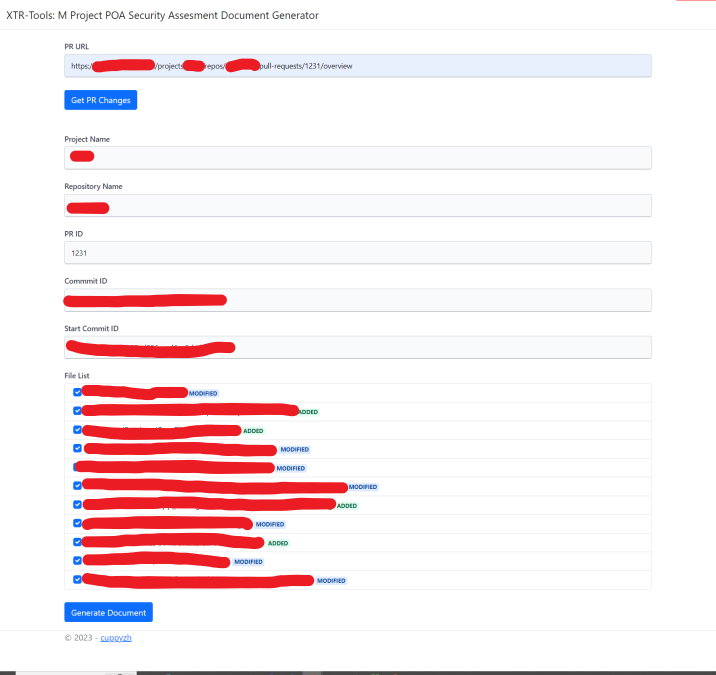

# POA Security Document Generator

This is a tool that can be used to extract changes from a PR into Excel document. This document usually given to Security Team or Related Parties to be reviewed or reported.

Unfortunately this tools is specific to be used on certain git server, and most likely can't be used with another git server.

# How to Install
You need .Net 7 in your device, then you can either:
- Run the code using IIS Express
- Or host it under IIS

# How to Use
- You only need your PR url with format: http://gitserver.com/projects/{projectName}/repos/{projectRespository}/pull-requests/{prId}/overview
- The tools will do the rest by it self

# Preview
UI View 

*I'm weak at Frontend-Design, so dealt with it >.<*

XLSX View

